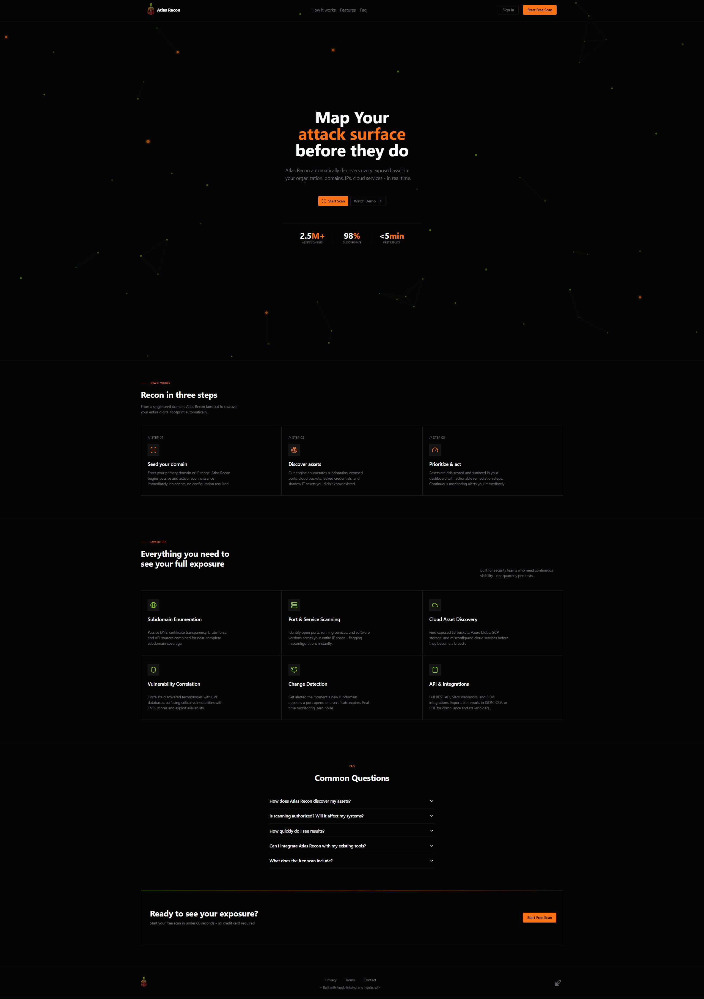

# Atlas Recon

Full-stack reconnaissance web application that features multiple data visualizations and real-time data updates. User authentication, scanning, and dashboard features are implemented. 

Built as a frontend portfolio project to showcase full-stack architecture, database integration, and user authentication.

---

## Live Demo

[View Project Live](https://code-switcher-website.vercel.app/)

---

## Features

- Authenticated user login
- Responsive UI
- Real-time data updates
- Reconnaissance scanning
- Dashboard with multiple data visualizations

---

## Built With

- React
- TypeScript
- Supabase
- Tailwind CSS
- Express
- Node.js

---
