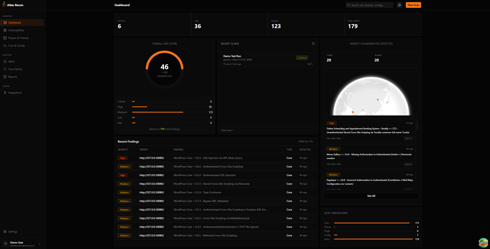
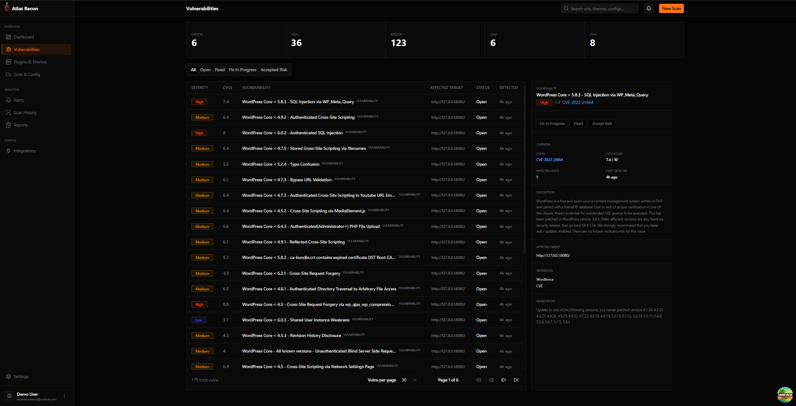
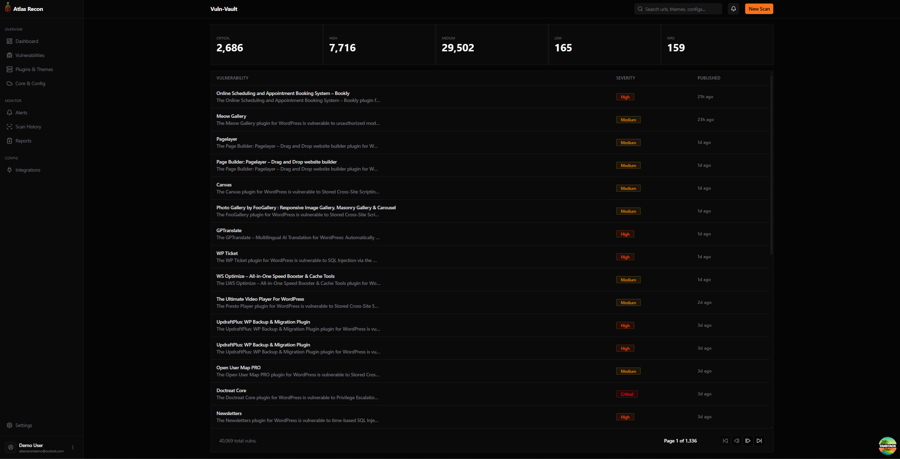
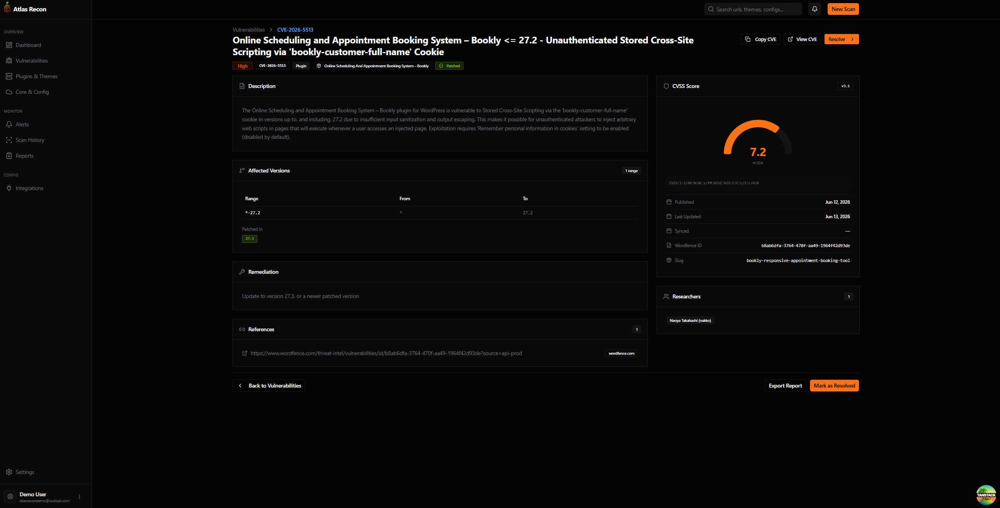

# Atlas Recon

A full-stack vulnerability management platform focused on WordPress security assessment, vulnerability intelligence, and attack surface visibility.

Atlas Recon combines active WordPress scanning with a continuously synchronized vulnerability intelligence database containing 40,000+ WordPress vulnerabilities from Wordfence. The platform provides real-time scan results, vulnerability enrichment, risk scoring, asset tracking, and remediation workflows through a modern dashboard experience.




## Features

### Vulnerability Intelligence

- 40,000+ WordPress vulnerabilities synchronized from Wordfence
- CVE, CVSS, CWE, remediation, and affected version tracking
- Real-time vulnerability enrichment
- Searchable Vulnerability Vault
- Historical vulnerability data

### WordPress Security Scanning

- WordPress core detection
- Plugin and theme enumeration
- Vulnerability correlation against discovered assets
- Automated vulnerability matching
- Scan history and reporting

### Dashboard & Analytics

- Risk scoring system
- Severity distribution visualizations
- Asset breakdown reporting
- Recent findings dashboard
- Real-time scan updates

### Vulnerability Management

- Vulnerability lifecycle tracking
- Open / Fixed / Accepted Risk workflows
- Detailed vulnerability views
- Remediation guidance
- Exportable reports

### Authentication & Access Control

- Better Auth authentication system
- Session management
- Protected routes
- Role-based architecture
- Secure API access


## Screenshots

### Security Dashboard


Provides risk scoring, asset visibility, scan activity, and vulnerability trends.

### Vulnerability Management



Track findings across scanned assets with severity classification, remediation details, and workflow status management.

### Vulnerability Intelligence Vault



A searchable repository containing over 40,000 WordPress vulnerabilities synchronized from Wordfence.

### Vulnerability Detail View



Detailed CVE information including affected versions, remediation guidance, references, CVSS scoring, and disclosure metadata.

## Architecture

### Frontend

- React 19
- TypeScript
- TanStack Router
- TanStack Query
- TanStack Table
- Tailwind CSS
- Shadcn UI

### Backend

- Node.js
- Express
- Better Auth
- BullMQ
- Redis

### Database & Infrastructure

- Supabase
- PostgreSQL
- Redis
- Docker

### Security Intelligence

- WPScan
- Wordfence Vulnerability Feed

## Key Technical Highlights

- Real-time vulnerability enrichment pipeline
- Background job processing with BullMQ
- Redis-backed caching and synchronization
- Wordfence vulnerability synchronization worker
- Protected API architecture
- Custom vulnerability matching engine
- Scalable pagination for 40,000+ vulnerability records
- Type-safe API and database interactions

## Local Development

```bash
git clone https://github.com/your-username/atlas-recon.git

cd atlas-recon

pnpm install

pnpm start
```

## Future Enhancements

- Multi-target scanning
- Scheduled scans
- Email notifications
- Team collaboration
- Advanced reporting
- Additional vulnerability intelligence sources
- Asset inventory management

## Disclaimer

Atlas Recon is a portfolio project built for educational purposes and to demonstrate full-stack application architecture, authentication systems, background job processing, vulnerability intelligence integration, and security-focused dashboard design.
